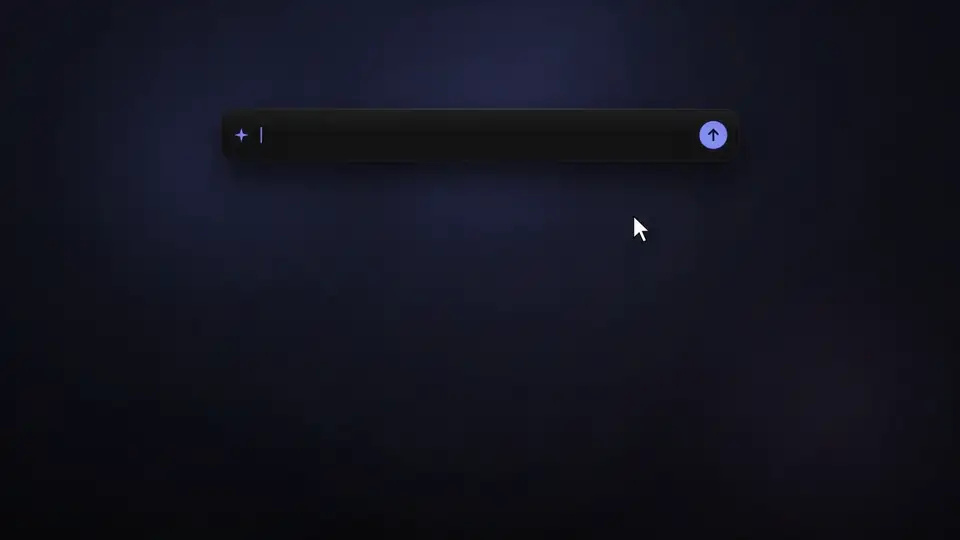
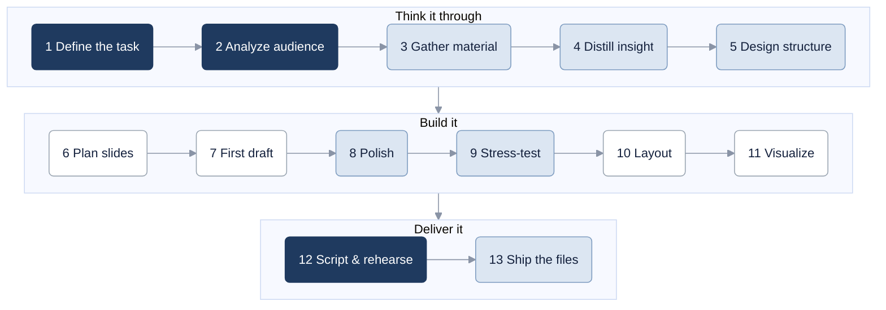

# AI Presentation Master (AI 簡報大師)

[繁體中文](README.md) · **English**

<p align="center">
  <a href="docs/ai-presentation-master-intro.mp4"></a>
</p>
<p align="center"><sub>Click for the full video with music (MP4, 36s)</sub></p>

**AI can generate a beautiful deck in one click. Then your boss interrupts halfway: "So what's the conclusion?"**

AI Presentation Master (Chinese name: AI 簡報大師) is a skill that shows you how to **use AI tools to design a complete presentation, from idea to stage**: shaping your argument, structuring it, turning bullet lists into diagrams, setting layout and color, handing specs to tools like Gamma or Canva, and preparing your script, Q&A and final delivery checks — the whole deck, end to end.

The split is simple: **you set the direction, AI tools build it out.** The point of view and judgment are yours; AI does the making.

It uses the standard `SKILL.md` format and works with Claude Code, Codex, Gemini CLI, Cursor and other tools that support agent skills.

> **Language note:** the skill's content (`SKILL.md` and `references/`) is written in Traditional Chinese. It is designed for Chinese-speaking users; the agent will still follow it if you talk to it in English, but examples and prompt templates are in Chinese.

---

## Same request, two approaches

> "Next week I'm presenting a new project to my manager. 20 minutes."

**Ask an AI to just make it:** most people open with "Make me a presentation on X" and get 15 dense slides. The data is all there and neatly arranged, but that's just data laid out, not a presentation. A presentation walks people to a conclusion.

**Collaborate with AI:**

1. **Don't open with "make me":** first say who it's for, how much time you have, and what you want them to do afterward. Then add: "Don't build anything yet — ask me questions first." The AI asks about the parts you haven't thought through.
2. **Let AI gather the material:** finding reports, organizing data, cross-checking sources. Require a source for every item, and if it can't find something, it should say so instead of filling the gap. You decide which material is worth putting on stage.
3. **Work out the message together:** ask "What claims can this data support?" It offers two or three directions; you pick one, then ask it to argue the other side. The sentence that survives is your message. Data is material; the claim is the presentation.
4. **Slide count is calculated:** reserve time for Q&A first, which leaves about 15 minutes of talking out of 20. An audience remembers at most three key points, so you land at roughly 12–20 slides—calculated, not guessed.
5. **Find the relationship before drawing:** are the bullets a sequence, a contrast, a cause, or an overlap? Once you know, choose a step bar, quadrant or arrows; then unify layout and colors.
6. **Hand off to tools last:** once the spec is clear, give it to Gamma, Canva or similar tools to build.

The difference isn't whether the slides look good. It's whether **you know what you're trying to convince them of** when you walk in.

---

## Stuck on one of these?

| What's happening | How it helps |
|---|---|
| Your manager cuts in: "So what's the conclusion?" | Switch to a conclusion-first structure; slide one states the decision you need |
| 32 slides, and your time just got cut in half | Cut evidence, not structure: drop from 3 messages to 2 and keep only the strongest example for each — don't just talk faster |
| A slide full of bullet points looks dull | First identify the relationship behind the bullets (sequence, composition, contrast, cause, overlap), then choose a step bar, quadrant or arrow chain |
| 40 carefully designed slides that still feel messy together | Set layout templates, align to a grid, unify icons and colors, plan the visual rhythm of the whole deck |
| The text sounds hollow, like AI wrote it | Point out the specific "AI tells" and rewrite with word limits and a banned-phrase list |
| You handed it to Gamma and the emphasis disappeared | Write a slide spec card — where the focus is, what the proportions are, what's forbidden — then translate it into instructions the tool follows |
| Sending it to a client and worried the fonts will break | Confirm the venue's aspect ratio and verify font embedding with `pdffonts` instead of trusting your own screen |
| Afraid the CFO will grill you | Anticipate tough questions, recognize questioner types, practice a four-step on-stage answer |
| You need to teach colleagues a 3-hour AI workshop | Plan with a module timetable instead of a slide count, cap lecture time, and design practice with feedback |

---

## Before and after

**Original**

> In this rapidly changing era full of challenges and opportunities, pushing this new project forward is an irreversible trend. Let's join hands to create a better future together.

**Problems:** stacked adjectives, no concrete information, and the audience doesn't know what to do afterward.

**Rewrite direction** (illustrative — replace the placeholders with your own real data)

> The team spends [X] hours a week on [a specific task]. This new project brings that down to [Y] hours — today I'm asking you to decide whether we start.

It will ask you for real numbers. It won't make one up and put it on your slide.

---

## You're the director; AI is the effects team

The full process has 13 steps, each labeled by who leads: you own the point of view, audience judgment and delivery; AI drafts layouts and charts first, and you review.



<sub>Dark: speaker leads · Light blue: co-created · White: AI drafts, speaker reviews</sub>

It covers four settings, each with its own success criteria and reading path: **business pitches, internal reports, public talks, and training sessions.** The same question can have opposite answers depending on the setting — information density, for example, should be low for a live talk and can be high for a deck people read on their own.

---

## What it doesn't do

- **It doesn't generate slide files in one click.** Once you've thought it through, build it in Gamma, Canva, open-slide or whatever you use; it helps you write the spec in a form those tools follow.
- **It doesn't invent cases or numbers.** Persuasion comes from real experience. Ask it to "make up a case" and it will first ask whether you have a real one to use.
- **It doesn't replace rehearsal.** Eye contact, pauses and reading the room can't be practiced by chatting with an AI. It will remind you to run it once in front of a real person.

---

## Install

Put the folder in your agent's skills directory. For Claude Code:

```bash
git clone https://github.com/chengwesley/ai-presentation-master ~/.claude/skills/ai-presentation-master
```

## Try one of these first

- "I have a 15-minute talk — how many slides should I make?"
- "I'm pitching a client next week and I'm worried about tough questions. How do I prepare?"
- "This slide lists five items and looks boring. Can it become a diagram?"

---

## Files

```
ai-presentation-master/
├── SKILL.md            # Entry point: process, scenario routing, principles
├── references/         # 14 topic files, loaded on demand by scenario or symptom
└── evals/              # 9 scenario test cases + 20 trigger tests
```

## License

[MIT](LICENSE)
