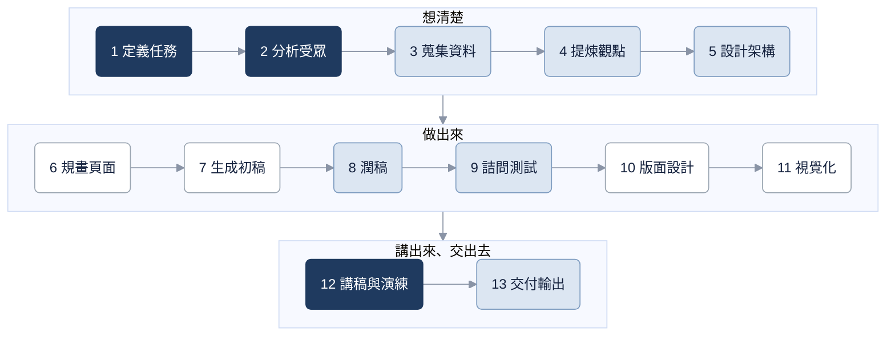

# AI 簡報大師｜AI Presentation Master

**繁體中文** · [English](README.en.md)

<p align="center">
  <a href="docs/ai-presentation-master-intro.mp4"></a>
</p>
<p align="center"><sub>點圖片看含配樂的完整影片（MP4，45 秒）</sub></p>

**AI 一鍵生成的簡報很漂亮，但老闆聽到一半就問：「所以結論是什麼？」**

**AI 簡報大師**（AI Presentation Master）是一個 skill，教你**用 AI 工具，從想法到上台，做出完整的簡報設計**：構思主張、安排結構、把條列變成圖解、定版型與配色、交給 Gamma／Canva 等工具產出，一直到講稿、Q&A 與交付檢查，整份簡報設計一次到位。

分工很清楚：**你定方向，AI 工具展開。** 觀點與判斷是你的，AI 負責把它做出來。

它是通用的 `SKILL.md` 格式，Claude Code、Codex、Gemini CLI、Cursor 等支援 agent skills 的工具都能安裝。

---

## 同一個題目，兩種做法

> 「下週要跟主管報告一個新專案，20 分鐘。」

**直接叫 AI 做**：多數人第一句就打「幫我做一份 OOO 的簡報」，拿到 15 頁密密麻麻的投影片。資料都在，排得也整齊，但那只是把資料攤開，不是簡報。簡報是帶人走到一個結論。

**跟 AI 協作**：

1. **開場第一句不說「幫我做」**：先講要講給誰聽、有多少時間、希望對方聽完做什麼，再補一句「先別做，你先問我問題」。AI 會反問你還沒想清楚的地方。
2. **資料讓 AI 去蒐集**：找報告、整理數據、比對來源。要求每筆附出處，找不到就說找不到，不要自己補。哪些素材值得上台，由你決定。
3. **主題跟 AI 討論出來**：問它「這些資料能支撐什麼主張？」它給兩三個方向，你挑一個，再請它站在反方挑戰。留下來的那句話，才是主題。資料是素材，主張才是簡報。
4. **頁數是算出來的**：20 分鐘要先留 Q&A，實際講述只有 15 分鐘左右；聽眾記得住的重點最多三個，所以頁數大約落在 12–20 頁——不是憑感覺。
5. **先找關係再畫圖**：條列之間是順序、對立、因果還是交集？找到關係，再決定畫成步驟條、象限還是箭頭；最後統一版型與配色。
6. **最後才交給工具**：規格想清楚了，才交給 Gamma、Canva 等工具做出來。

差別不在投影片好不好看，而在**你上台時知不知道自己要說服對方什麼**。

---

## 你是不是卡在這裡？

| 你遇到的狀況 | 它會怎麼幫你 |
|---|---|
| 主管聽到一半就打斷：「所以結論是什麼？」 | 改用結論先行的結構，第一頁就講要對方做什麼決定 |
| 簡報 32 頁，時間突然被砍半 | 砍佐證、不砍結構：3 個訊息減成 2 個，每個訊息只留最強的例子，而不是每頁講快一點 |
| 這頁全是條列，看起來很無聊 | 先找出條列背後的關係（順序、組成、對立、因果、交集），再決定畫成步驟條、象限還是箭頭鏈 |
| 整份 40 頁，每頁都排過，放在一起卻很雜 | 定版型、對齊網格、統一圖示與配色，安排整份的視覺節奏 |
| 讀起來很空洞，很像 AI 寫的 | 點出 AI 味的特徵，用字數限制與禁用詞清單重寫 |
| 交給 Gamma 做，強調的重點全不見了 | 用頁面規格卡把「重點在哪、比例多少、不准做什麼」寫清楚，再翻譯成工具聽得懂的指令 |
| 寄給客戶，怕字型在對方電腦跑掉 | 確認現場設備比例，用 `pdffonts` 實際驗證字型有沒有嵌入，不靠目視 |
| 很怕被財務長問倒 | 預先列出刁難問題、分類提問者，練習現場回答的四個步驟 |
| 要幫同事上三小時的 AI 課 | 改用模組時間表而不是頁數，控制講述比例，設計練習與回饋 |

---

## 講者是總導演，AI 是特效團隊

完整流程有 13 個步驟。每一步都標明誰主導：觀點、受眾判斷與上台表現由你負責；初稿、版面與圖表由 AI 先做、你把關。



<sub>深色：講者主導　淺藍：人機共創　白色：AI 先做、講者把關</sub>

涵蓋四種場合，各有不同的成功標準與閱讀路徑：**商業提案、對內匯報、公開講座、教育訓練**。同一個問題在不同場合的答案可能相反——例如資訊密度，現場講要少，寄出去給人讀可以多。

---

## 它不做什麼

- **不一鍵生成投影片檔案。** 想清楚之後，交給 Gamma、Canva、open-slide 或你習慣的工具做出來；它會幫你把規格寫成那些工具聽得懂的樣子。
- **不替你編案例或數字。** 簡報的說服力來自真實經驗。你要它「編一個案例」，它會先問你有沒有真的經驗可以用。
- **不能代替彩排。** 眼神、停頓、現場氣氛，跟 AI 對答幾輪不等於演練過。它會提醒你對真人講一次。

---

## 安裝

把整個資料夾放進你的 agent 的 skills 目錄。以 Claude Code 為例：

```bash
git clone https://github.com/chengwesley/ai-presentation-master ~/.claude/skills/ai-presentation-master
```

## 第一句可以這樣試

- 「我 15 分鐘的分享，大概要做幾頁？」
- 「下週要跟客戶提案，我很怕被問倒，要怎麼準備？」
- 「這頁列了五個項目，看起來超無聊，可以變成圖嗎？」

---

## 檔案結構

```
ai-presentation-master/
├── SKILL.md            # 入口：流程、情境路由、使用原則
├── references/         # 14 份主題文件，依情境或症狀按需讀取，不會一次全部載入
└── evals/              # 9 個情境測試案例＋20 題觸發測試
```

## 授權

[MIT](LICENSE)

## 作者

**Wesley Cheng**

[](https://github.com/chengwesley)
[](https://www.linkedin.com/in/%E6%99%BA%E7%B6%AD-%E9%84%AD-547406133/)
[](mailto:wesleylavie@gmail.com)
